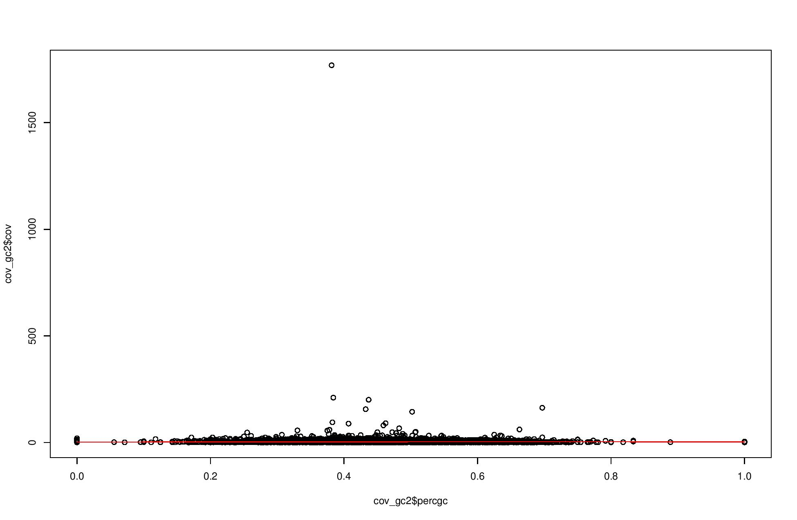
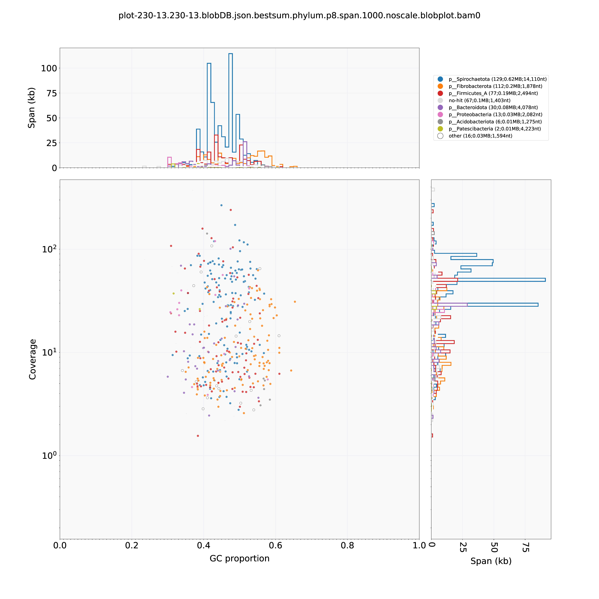
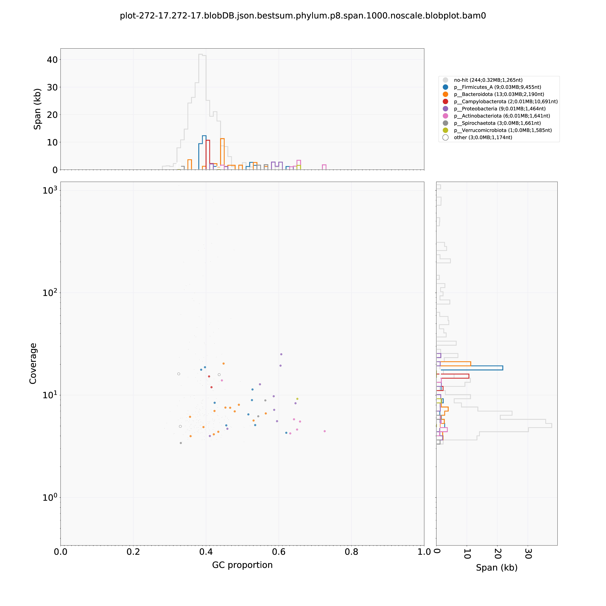
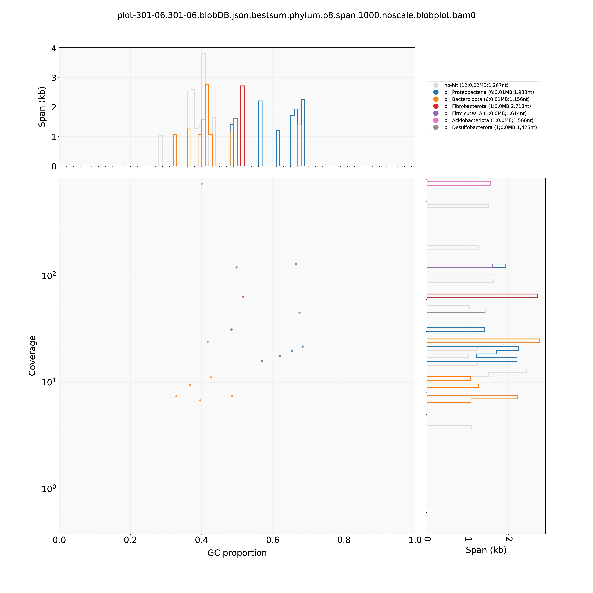

## Is there a GC bias in the metagenome data? Every sequencing data has GC bias introduced during the PCR amplification step. But is it affecting the distribution of contigs for a specific GC content?

### A)Extract GC from each contig using 1000bp window size (Chen et al 2020)

```
#!/bin/bash
#SBATCH -p largemem
#SBATCH -t 6-0
#SBATCH --mem=350G
#SBATCH -e err_bedtools.%j

#SBATCH --array 0
#load the libraries-
module load bedtools/v2.29.2

IN_DIR="/bucket/BourguignonU/Jigs_backup/working_files/AIMS/AIM2/tpm_functional_annotation/functional_annotation/gc_coverage_march2021"
OUT_DIR="/flash/BourguignonU/Jigs/gtdb/megan6_3samples"
#call the folders-

#cd ${IN_DIR}/
#files=(filename-272-82.fasta filename-301-68.fasta filename-229-05.fasta)
#files=(filename-272-82.fasta)
##echo "list: " ${files[${SLURM_ARRAY_TASK_ID}]} # this generates a list of $sf files
#file1=${files[${SLURM_ARRAY_TASK_ID}]} #it reads each index at a time
#file2=${file1/filename-/}
#file3=${file2/.fasta/}

bedtools makewindows -b ${IN_DIR}/2-sorted_272-82-prokka.map.gtf.bed -w 1000 -s 10 > 272-82-windows.txt
#-w 1000, -s 10 based on Chen et al 2020 paper.
bedtools nuc -fi filename-272-82.fasta -bed 272-82-windows.txt  -s  -fullHeader  > 272-82-gc-perwindow.txt

#fasta file should be in /flash/ as fasta index is generated in the "bedtools nuc" script.
#scripts based on-https://wiki.bits.vib.be/index.php/Create_a_GC_content_track#create_a_N-base_wide_step_file_from_the_chromosome_list_with_Bedtools_makewindows

awk -F"\t" '{print $1","$5}' 272-82-gc-perwindow.txt > 2-272-82-gc-perwindow.txt
```

### B)Plots of GC content per contig vs contig coverage (obtained from metaSPAdes analysis)

```
library(dplyr)
gc<-read.csv("2-272-82-gc-perwindow.txt")
colnames(gc)<-c("contigs","percgc")

#read the coverage file-
cov<-read.csv("filename-272-82-original-new-headerinfo",header=FALSE,sep="\t")
cov$V2<-gsub("^NODE.*cov_","",cov$V2)
cov$V1<-gsub("-original-new-headerinfo","",cov$V1)
cov$contigs<-paste(as.factor(cov$V1),as.factor(cov$V3),sep="_")
colnames(cov)<-c("samples","cov","contignames","contigs")

#join the two files-
cov_gc<-merge(cov,gc,by="contigs")
write.csv(cov_gc,file="272-82-cov-gc.csv")

#plot1-scatter plot-https://www.biostars.org/p/6357/
pdf("cov_gc_272-82-scatterplot.pdf", width=13, height=8.5)
plot(x=cov_gc$percgc, y=cov_gc$cov)
lines(lowess(x=cov_gc$percgc, y=cov_gc$cov), col=2)
dev.off()

#plot randomly extracted rows from the df-
cov_gc2<-cov_gc[sample(nrow(cov_gc), 10000), ]

pdf("cov_gc_272-82-scatterplot_random10000contigs.pdf", width=13, height=8.5)
plot(x=cov_gc2$percgc, y=cov_gc2$cov)
lines(lowess(x=cov_gc2$percgc, y=cov_gc2$cov), col=2)
dev.off()

#plot2-histgram-https://www.biostars.org/p/165772/
pdf("gc_histogram-272-82.pdf", width=13, height=8.5)
hist(cov_gc$percgc, breaks=25, main="GC content histogram", xlab="GC content (%)", ylab="Contigs(#)")
dev.off()

```




### C)Overall distribution of GC among microbial taxa-using Blobtools
```
##diamond blobtools-
diamond blastx --db ${DIAMONDDB}/gtdb.dmnd --query ${IN_DIR}/${file1} --outfmt 6 --out ${OUT_DIR}/gtdb-matches-${file1}.txt --sensitive --evalue 1e-25 --threads 15 --long-reads
#--long-reads added as suggested by  http://megan.informatik.uni-tuebingen.de/t/problem-in-taxonomic-and-functional-annonation/1448
#blastx is better because it is not restricted to annotated proteins in a contig
#--evalue  1e-25 and --sensitive as suggested by https://blobtools.readme.io/docs/taxonomy-file

##blobtools taxify-
blobtools taxify --hit_file gtdb-matches-${file1}.txt --taxid_mapping_file /apps/unit/BioinfoUgrp/DB/diamondDB/GTDB/r95/taxdmp/accession2taxid.tsv --map_col_sseqid 1 --map_col_taxid 2 -o taxified-gtdb-matches-${file1}.txt

##create a bamfile for the sample-
samtools sort -o ${IN_DIR}/3contigs-230-12-gtdb-sorted.bam ${IN_DIR}/3contigs-230-12-gtdb.sam
samtools index ${IN_DIR}/3contigs-230-12-gtdb-sorted.bam #index the bam file

##blobtools create-
blobtools create --infile ${IN_DIR}/${file1} --hitsfile ${IN_DIR}/taxified-gtdb-matches-${file3}.taxified.out --min_score 140 --nodes /apps/unit/BioinfoUgrp/DB/diamondDB/GTDB/r95/nodes.dmp --names /apps/unit/BioinfoUgrp/DB/diamondDB/GTDB/r95/names.dmp --bam ${IN_DIR}/3contigs-${file3}-gtdb-sorted.bam --calculate_cov --out ${file3}
#--min_score 140 <same as megan>
#evalue 1e-25 already used during diamond blast results.


##blobtools view-
#blobtools view --input 230-12-3contigs.blobDB.json --out 230-12-3contigs-view --rank all --cov

##blobtools GC vs Coverage plot-
blobtools plot -i 230-12-3contigs.blobDB.json --plotgroups 8 --length 1000 --noscale --rank phylum --format pdf --out plot-230-12-3contigs

```

```
NOTE-There is GC bias in the sequenced data. Salmon software was applied to account for GC bias in microbial contigs.
```







